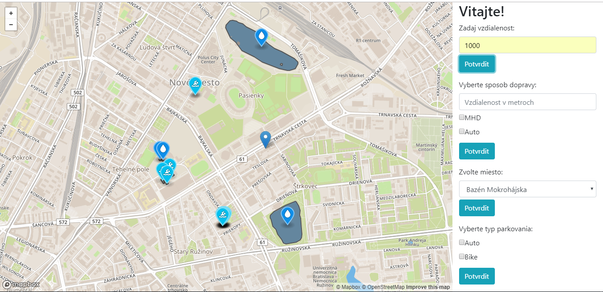
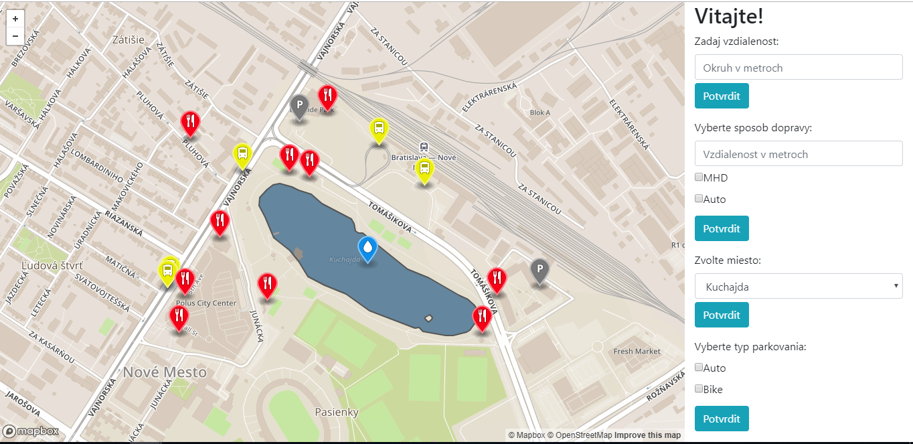

# Overview

Application SwimUp shows places to swim swimming pools, lakes, reservoirs and ponds in Bratislava on a map. It also shows bus stops, car parks and restaurants around those places and shopping malls which contain the car or bike park. Most important features are:
- search swimming places within a specified distance of my current location
- search swimming places along with bus stops or car parks which are located within a certain distance of swimming place
- intelligent ordering - search 10 the most closest restaurants by distance around the selected place 
- search shopping malls which contain car or bike par

This is it in action:





The application has 2 separate parts, the client which is a [frontend web application](#frontend) using mapbox API and mapbox.js and the [backend application](#backend) written in [JavaScript](https://www.javascript.com/), backed by PostGIS. The frontend application communicates with backend using a [REST API](#api).

# Frontend

The frontend application is a static HTML page (`views/index.ejs`) with Bootstrap 4 styling, which shows a mapbox.js widget and a sidebar with user interface. It is displaying swimming pools, lakes, restaurants, bus stations, car parks, which are mostly in cities, thus the map style is based on the street style.

All relevant frontend code is in `public/script.js` which is referenced from `index.ejs`. The frontend code is very simple, its only responsibilities are:
- displaying the sidebar panel with swimming place list and searching controls, driving the user interaction and calling the appropriate backend APIs
- displaying geo features by overlaying the map with a geojson layer, the geojson is provided directly by backend APIs
- displaying custom marker for each kind of geojson result

# Backend

The backend application is written in JavaScript and is responsible for querying geo data and formatting the geojson for map.

## Data

Data is coming directly from Open Street Maps. I downloaded an extent covering Bratislava and imported it using the `osm2pgsql` tool into the standard OSM schema in WGS 84 with hstore enabled. To speedup the queries I created an index on geometry column (`way`) in point table. The application follows standard Node.js Express framework conventions and all queries are placed in inside `app.js`. GeoJSON is generated by using a standard `st_asgeojson` function.

## Api

**Find swimming places in specified distance to coordinates**

`GET /radius/?distance=1000&longitude=17.0682957&latitude=48.1580529`

**Find swimming place along with car parks which are located in specified distance to the swimming place**

`GET /transport/?transport=car&trans=100`

**Find swimming place by name along with restuarants sorted by proximity**

`GET /meals/?place=Kuchajda`

**Find shopping malls which contain bike park**

`GET /mall_parking/?parking=bike_park`

### Response

API calls return json responses either in GeoJSON format.
```
{
    "geometry":{
        "coordinates":[
            [17.1384012, 48.1663078998977]
        ],
        "type":"Point"
    },
    "properties":{
        "title":"Plaváreň Pasienky",
        "description":"swimming_pool"
    },
    "type":"Feature"
}
```
